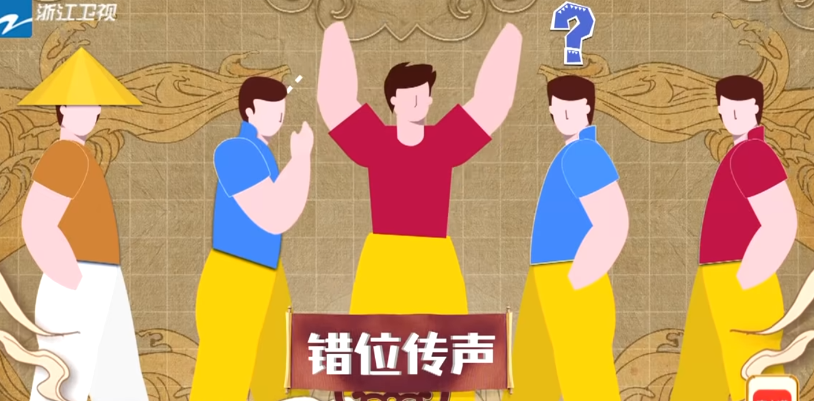

# GroupGame 團康遊戲

## 以訛傳訛

遊戲說明：以台語將話傳遞下去。(讓不會講台語的人穿插其中，使詞語被混淆。)

## 點餐遊戲

- 如果點重複的話，那該餐點就被削掉。
- 如果別人跟你點重複的餐，那該餐點才會被點。

## 秒回訊息賽

發送照片至群組，等待家人回覆，家人回覆時間越短者排名越高。

## 海龜湯分隊競賽 (+印地安酋長)

 三人頭頂名牌輪流提問，用時最少，猜出自己頭頂名牌的成員獲勝。

## 知己知彼

每輪遊戲以一位成員為目標，其餘成員寫下該人的七個優點，目標成員限時描述自己的優點，重合數量更多的人獲勝。

## 錯位傳聲

中間隔一個再往後傳，兩組需跨過對方成員傳話，努力不被干擾，傳遞正確效率高的隊伍獲勝。

