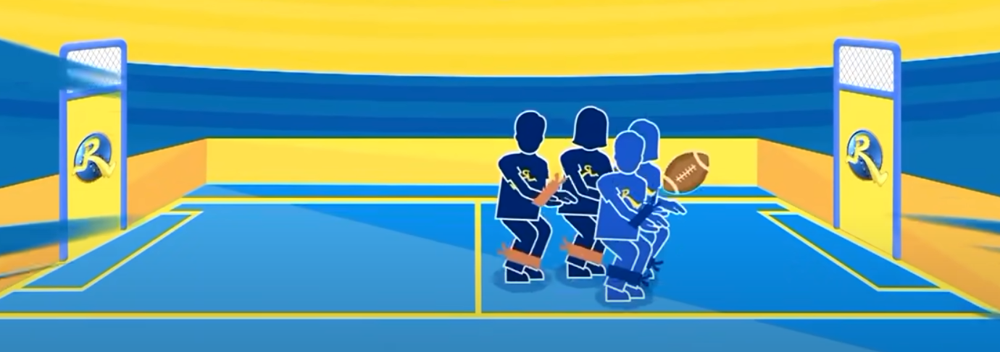

# 運動遊戲

## 拉手折返跑

- 設計理念：跑得快的人會被跑得慢的人牽制，以此平衡實力差距。
- 遊戲規則：
  折返跑完後，拉起下一位隊員進行折返跑，最終以全隊手牽手的形式完成折返跑。

## 水球遊戲

- 設計理念：實際的水球講求佔位和策略，但需具有一定的水中為一能力才能達成。
  此遊戲可以區分成 得分手，攔截手，防守手，四分衛傳球手。
  可以讓玩家依據個人能力選擇相應適合的角色。
- 遊戲規則：玩家需將球池內的球搶回放入籃中，最終計算籃框內的球數(得分)高的隊伍獲勝。
- 示意圖：A隊籃框 (B隊起始位置)  球池  (A隊起始位置)  B隊籃框

## 4 v 4 橄欖球大戰

十位成員分成兩組，男生綁上手腳，女生綁上腳，進行 4 v 4 橄欖球賽。
時間比賽為 10 分鐘，哪一隊進球最多，則該隊獲勝。

Reference: [KeepRunning S9 EP2](https://www.youtube.com/watch?v=P9nVMPKFwAU)

## 矇眼前滾翻

Reference: [《奔跑吧·黃河篇第二季》 EP5](https://www.youtube.com/watch?v=br4hnOEr1a4)

## 瞄準時機，沖沖沖

在 35 米的區間內，會有一個輪胎從起點往下滾，大家從輪胎中心穿過去，並且不把她碰倒，
第 10 個結束之後，第一個又可以循環回來到第 11 個位置，在輪胎滾出界線之前，累計穿過輪胎人次最多的隊獲勝。
( 如果前3個人碰倒的話，可以重來。)
